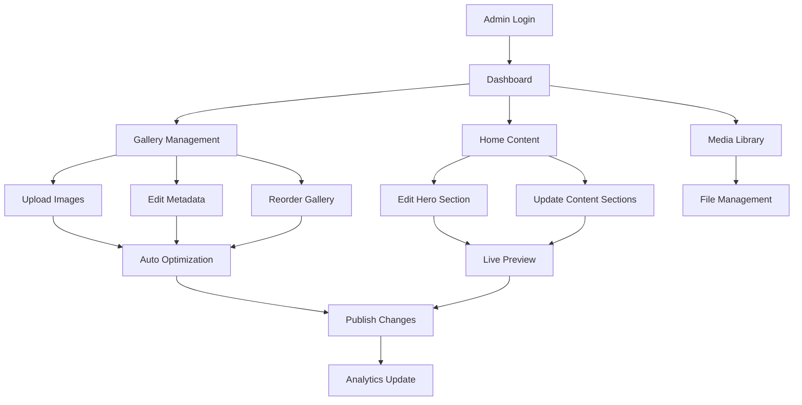

# Admin Panel CMS - Product Requirements Document

## 1. Product Overview
Admin Panel CMS yang elegan dan powerful untuk mengelola konten Gallery dan Home pada aplikasi Cycent Cinema. Panel ini menyediakan interface yang intuitif dan profesional untuk admin dalam mengelola gambar gallery, konten halaman utama, dan pengaturan sistem dengan design luxury yang konsisten.

Produk ini memungkinkan admin untuk mengelola seluruh konten website secara real-time, mengoptimalkan workflow content management, dan menjaga konsistensi brand luxury cinema melalui interface yang user-friendly dan responsive.

## 2. Core Features

### 2.1 User Roles
| Role | Registration Method | Core Permissions |
|------|---------------------|------------------|
| Admin | Manual registration dengan approval | Gallery management, Home content editing, Profile management |
| Super Admin | System-level access | Full admin management, System settings, User management, Analytics |

### 2.2 Feature Module
Admin Panel CMS terdiri dari modul utama berikut:
1. **Dashboard Overview**: Analytics, quick stats, recent activities, dan system health monitoring.
2. **Gallery Management**: Upload, edit, delete, reorder gambar dengan drag & drop interface dan bulk operations.
3. **Home Content Management**: Edit hero section, about content, features, testimonials dengan live preview.
4. **Authentication System**: Secure login, profile management, password change dengan session monitoring.
5. **Media Library**: Centralized file management dengan advanced search dan filtering capabilities.

### 2.3 Page Details
| Page Name | Module Name | Feature Description |
|-----------|-------------|---------------------|
| Login Page | Authentication | Secure admin login dengan JWT, remember me, forgot password |
| Dashboard | Overview | Statistics cards, recent activities, quick actions, system alerts |
| Gallery Manager | Gallery Management | Image grid dengan drag-drop upload, bulk edit, metadata management |
| Gallery Editor | Gallery Management | Individual image editing, crop, resize, SEO optimization |
| Home Content | Content Management | Section-based editing dengan live preview, rich text editor |
| Hero Editor | Content Management | Hero section management dengan background image/video upload |
| Media Library | Media Management | File browser, search, filter, bulk operations, storage analytics |
| Profile Settings | User Management | Admin profile, password change, notification preferences |
| System Settings | Administration | Site configuration, API settings, backup management |

## 3. Core Process

**Admin Daily Workflow:**
1. Admin login → Dashboard overview → Check recent activities dan system alerts
2. Gallery management → Upload new images → Edit metadata → Reorder gallery
3. Home content editing → Update hero section → Modify featured content → Preview changes
4. Publish changes → Monitor live updates → Review analytics

**Content Management Flow:**
1. Content creation/editing → Auto-save drafts → Preview mode → Publish/Schedule
2. Media upload → Auto-optimization → Metadata tagging → Library organization
3. Bulk operations → Progress tracking → Completion notifications

## 4. User Interface Design

### 4.1 Design Style
- **Primary Colors**: Deep charcoal (#1a1a1a), Luxury gold (#d4af37), Cinema red (#dc2626)
- **Secondary Colors**: Soft white (#fafafa), Muted gray (#6b7280), Success green (#10b981)
- **Button Style**: Rounded corners (8px), gradient backgrounds, smooth hover transitions
- **Typography**: Inter font family, 14-16px base, clear hierarchy dengan golden accents
- **Layout Style**: Sidebar navigation, card-based content, responsive grid system
- **Icons**: Lucide React icons, 20px standard size, consistent styling

### 4.2 Page Design Overview
| Page Name | Module Name | UI Elements |
|-----------|-------------|-------------|
| Dashboard | Overview Cards | Gradient stat cards, activity timeline, quick action buttons |
| Gallery Manager | Image Grid | Masonry layout, drag-drop zones, hover overlays, bulk selection |
| Gallery Editor | Edit Interface | Split-screen layout, image preview, metadata forms, action toolbar |
| Home Content | Content Editor | Tabbed sections, rich text editor, live preview panel |
| Media Library | File Browser | Grid/list view toggle, advanced filters, search bar, upload dropzone |
| Login Page | Authentication | Centered card, animated inputs, brand elements, security indicators |

### 4.3 Responsiveness
Desktop-first design dengan mobile-adaptive interface. Touch-optimized untuk tablet usage dengan gesture support untuk drag-drop operations, swipe navigation, dan pinch-to-zoom untuk image editing.

## 5. Security Requirements

### 5.1 Authentication & Authorization
- JWT-based authentication dengan refresh tokens
- Role-based access control (RBAC)
- Session timeout dan auto-logout
- Multi-factor authentication (optional)
- Password strength requirements
- Login attempt monitoring dan rate limiting

### 5.2 Data Security
- Input validation dan sanitization
- XSS protection untuk rich text content
- CSRF protection untuk form submissions
- File upload security scanning
- Audit logging untuk admin actions
- Secure file storage dengan access controls

## 6. Performance Requirements

### 6.1 Loading Performance
- Initial page load < 2 seconds
- Image optimization dengan lazy loading
- Progressive loading untuk large galleries
- Caching strategy untuk frequently accessed data
- CDN integration untuk media files

### 6.2 User Experience
- Real-time auto-save untuk content editing
- Optimistic UI updates
- Smooth animations dan transitions
- Keyboard shortcuts untuk power users
- Undo/redo functionality
- Bulk operation progress indicators

## 7. Integration Requirements

### 7.1 Backend API Integration
- RESTful API consumption dengan proper error handling
- Real-time updates via WebSocket (optional)
- File upload dengan progress tracking
- API rate limiting compliance
- Offline capability dengan sync when online

### 7.2 Third-party Services
- Image optimization service integration
- Analytics tracking (Google Analytics)
- Error monitoring (Sentry)
- Backup service integration
- Email notification service