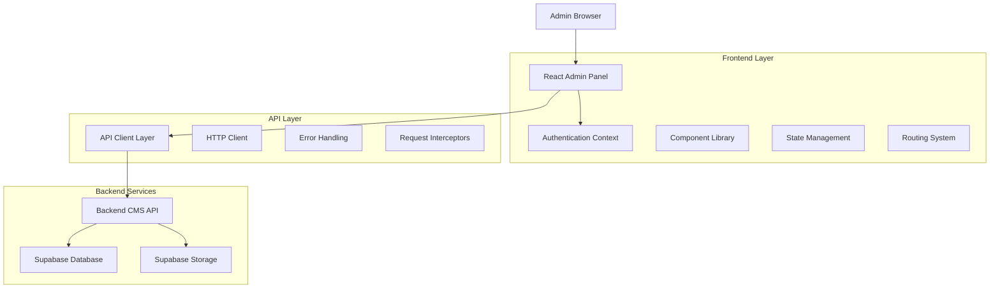
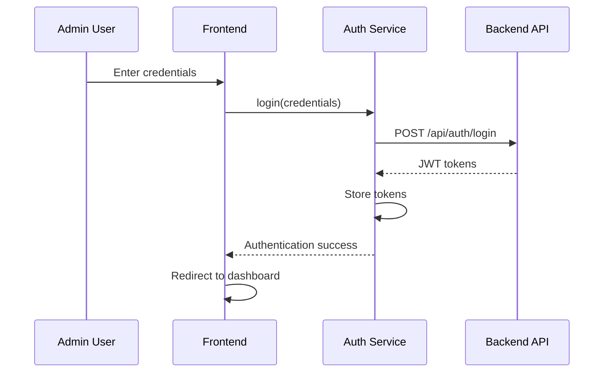
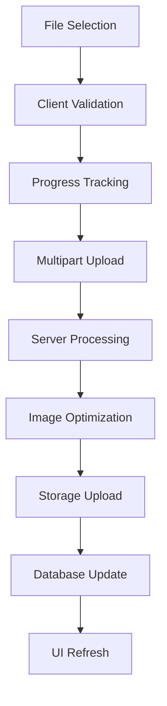

# Admin Panel CMS - Technical Architecture Document

## 1. Architecture Design



## 2. Technology Description
- Frontend: React@18 + TypeScript + Vite + Tailwind CSS
- State Management: React Context API + Custom Hooks
- Routing: React Router DOM v6
- HTTP Client: Axios dengan interceptors
- Form Handling: React Hook Form + Zod validation
- UI Components: Custom components + Headless UI
- File Upload: React Dropzone + Progress tracking
- Authentication: JWT tokens dengan auto-refresh

## 3. Route Definitions
| Route | Purpose | Access Level |
|-------|---------|--------------|
| /admin/login | Admin authentication page | Public |
| /admin/dashboard | Main dashboard overview | Admin |
| /admin/gallery | Gallery management interface | Admin |
| /admin/gallery/upload | Bulk image upload page | Admin |
| /admin/gallery/:id/edit | Individual image editor | Admin |
| /admin/home | Home content management | Admin |
| /admin/home/hero | Hero section editor | Admin |
| /admin/media | Media library browser | Admin |
| /admin/profile | Admin profile settings | Admin |
| /admin/settings | System settings | Super Admin |

## 4. Component Architecture

### 4.1 Core Components Structure

```
src/
├── admin/
│   ├── components/
│   │   ├── layout/
│   │   │   ├── AdminLayout.tsx
│   │   │   ├── Sidebar.tsx
│   │   │   ├── Header.tsx
│   │   │   └── Breadcrumb.tsx
│   │   ├── ui/
│   │   │   ├── Button.tsx
│   │   │   ├── Input.tsx
│   │   │   ├── Modal.tsx
│   │   │   ├── Card.tsx
│   │   │   ├── Table.tsx
│   │   │   └── LoadingSpinner.tsx
│   │   ├── forms/
│   │   │   ├── LoginForm.tsx
│   │   │   ├── ImageUploadForm.tsx
│   │   │   ├── ContentEditor.tsx
│   │   │   └── ProfileForm.tsx
│   │   └── features/
│   │       ├── dashboard/
│   │       ├── gallery/
│   │       ├── home-content/
│   │       └── media-library/
│   ├── pages/
│   │   ├── LoginPage.tsx
│   │   ├── DashboardPage.tsx
│   │   ├── GalleryPage.tsx
│   │   ├── HomeContentPage.tsx
│   │   └── MediaLibraryPage.tsx
│   ├── hooks/
│   │   ├── useAuth.ts
│   │   ├── useGalleryAdmin.ts
│   │   ├── useHomeContentAdmin.ts
│   │   └── useMediaLibrary.ts
│   ├── services/
│   │   ├── adminApi.ts
│   │   ├── authService.ts
│   │   └── uploadService.ts
│   └── types/
│       └── admin.ts
```

### 4.2 State Management Strategy

**Authentication Context**
```typescript
interface AuthContextType {
  admin: Admin | null;
  isAuthenticated: boolean;
  login: (credentials: LoginCredentials) => Promise<void>;
  logout: () => void;
  refreshToken: () => Promise<void>;
  isLoading: boolean;
}
```

**Gallery Management Hook**
```typescript
interface UseGalleryAdmin {
  images: GalleryImage[];
  isLoading: boolean;
  error: string | null;
  uploadImages: (files: File[]) => Promise<void>;
  updateImage: (id: string, data: Partial<GalleryImage>) => Promise<void>;
  deleteImage: (id: string) => Promise<void>;
  reorderImages: (imageIds: string[]) => Promise<void>;
  refreshImages: () => Promise<void>;
}
```

## 5. API Integration Layer

### 5.1 HTTP Client Configuration

```typescript
// API Client with interceptors
const apiClient = axios.create({
  baseURL: process.env.VITE_API_BASE_URL,
  timeout: 30000,
});

// Request interceptor for authentication
apiClient.interceptors.request.use((config) => {
  const token = getAuthToken();
  if (token) {
    config.headers.Authorization = `Bearer ${token}`;
  }
  return config;
});

// Response interceptor for error handling
apiClient.interceptors.response.use(
  (response) => response,
  async (error) => {
    if (error.response?.status === 401) {
      await refreshAuthToken();
      return apiClient.request(error.config);
    }
    return Promise.reject(error);
  }
);
```

### 5.2 Service Layer Architecture

**Admin API Service**
```typescript
class AdminApiService {
  // Authentication
  async login(credentials: LoginCredentials): Promise<AuthTokens>
  async refreshToken(): Promise<AuthTokens>
  async getProfile(): Promise<Admin>
  
  // Gallery Management
  async getGalleryImages(params?: GalleryQueryParams): Promise<GalleryResponse>
  async uploadImage(file: File, metadata: ImageMetadata): Promise<GalleryImage>
  async updateImage(id: string, data: Partial<GalleryImage>): Promise<GalleryImage>
  async deleteImage(id: string): Promise<void>
  async reorderImages(imageIds: string[]): Promise<void>
  
  // Home Content Management
  async getHomeContent(): Promise<HomeContent[]>
  async updateHomeContent(section: string, data: Partial<HomeContent>): Promise<HomeContent>
  
  // Media Library
  async getMediaFiles(params?: MediaQueryParams): Promise<MediaResponse>
  async deleteMediaFile(id: string): Promise<void>
}
```

## 6. Authentication Flow

### 6.1 Login Process



### 6.2 Token Management

```typescript
class AuthService {
  private accessToken: string | null = null;
  private refreshToken: string | null = null;
  
  async login(credentials: LoginCredentials): Promise<void> {
    const response = await apiClient.post('/auth/login', credentials);
    this.setTokens(response.data.accessToken, response.data.refreshToken);
  }
  
  async refreshAccessToken(): Promise<void> {
    if (!this.refreshToken) throw new Error('No refresh token');
    
    const response = await apiClient.post('/auth/refresh', {
      refreshToken: this.refreshToken
    });
    
    this.setTokens(response.data.accessToken, response.data.refreshToken);
  }
  
  private setTokens(accessToken: string, refreshToken: string): void {
    this.accessToken = accessToken;
    this.refreshToken = refreshToken;
    localStorage.setItem('accessToken', accessToken);
    localStorage.setItem('refreshToken', refreshToken);
  }
}
```

## 7. File Upload Architecture

### 7.1 Upload Flow



### 7.2 Upload Service Implementation

```typescript
class UploadService {
  async uploadImages(
    files: File[],
    onProgress?: (progress: UploadProgress) => void
  ): Promise<GalleryImage[]> {
    const uploads = files.map(file => this.uploadSingleImage(file, onProgress));
    return Promise.all(uploads);
  }
  
  private async uploadSingleImage(
    file: File,
    onProgress?: (progress: UploadProgress) => void
  ): Promise<GalleryImage> {
    const formData = new FormData();
    formData.append('image', file);
    
    return apiClient.post('/gallery/upload', formData, {
      headers: { 'Content-Type': 'multipart/form-data' },
      onUploadProgress: (progressEvent) => {
        const progress = Math.round(
          (progressEvent.loaded * 100) / progressEvent.total
        );
        onProgress?.({ fileName: file.name, progress });
      }
    });
  }
}
```

## 8. Form Validation & Error Handling

### 8.1 Validation Schema

```typescript
// Zod schemas for form validation
const loginSchema = z.object({
  email: z.string().email('Invalid email format'),
  password: z.string().min(8, 'Password must be at least 8 characters')
});

const imageMetadataSchema = z.object({
  title: z.string().min(1, 'Title is required').max(255),
  description: z.string().max(1000).optional(),
  altText: z.string().max(255).optional(),
  tags: z.array(z.string()).optional()
});

const homeContentSchema = z.object({
  heroTitle: z.string().min(1, 'Hero title is required'),
  heroSubtitle: z.string().max(500).optional(),
  content: z.string().min(1, 'Content is required')
});
```

### 8.2 Error Boundary Implementation

```typescript
class AdminErrorBoundary extends Component<Props, State> {
  constructor(props: Props) {
    super(props);
    this.state = { hasError: false, error: null };
  }
  
  static getDerivedStateFromError(error: Error): State {
    return { hasError: true, error };
  }
  
  componentDidCatch(error: Error, errorInfo: ErrorInfo) {
    console.error('Admin panel error:', error, errorInfo);
    // Send to error reporting service
  }
  
  render() {
    if (this.state.hasError) {
      return <ErrorFallback error={this.state.error} />;
    }
    
    return this.props.children;
  }
}
```

## 9. Performance Optimization

### 9.1 Code Splitting Strategy

```typescript
// Lazy loading for admin routes
const DashboardPage = lazy(() => import('./pages/DashboardPage'));
const GalleryPage = lazy(() => import('./pages/GalleryPage'));
const HomeContentPage = lazy(() => import('./pages/HomeContentPage'));

// Route configuration with suspense
<Routes>
  <Route path="/admin" element={<AdminLayout />}>
    <Route index element={
      <Suspense fallback={<LoadingSpinner />}>
        <DashboardPage />
      </Suspense>
    } />
    <Route path="gallery" element={
      <Suspense fallback={<LoadingSpinner />}>
        <GalleryPage />
      </Suspense>
    } />
  </Route>
</Routes>
```

### 9.2 Caching Strategy

```typescript
// React Query for server state management
const useGalleryImages = () => {
  return useQuery({
    queryKey: ['gallery', 'images'],
    queryFn: () => adminApi.getGalleryImages(),
    staleTime: 5 * 60 * 1000, // 5 minutes
    cacheTime: 10 * 60 * 1000, // 10 minutes
  });
};

// Optimistic updates for better UX
const useUpdateImage = () => {
  const queryClient = useQueryClient();
  
  return useMutation({
    mutationFn: (data: UpdateImageData) => 
      adminApi.updateImage(data.id, data.updates),
    onMutate: async (data) => {
      // Optimistically update the cache
      await queryClient.cancelQueries(['gallery', 'images']);
      const previousImages = queryClient.getQueryData(['gallery', 'images']);
      
      queryClient.setQueryData(['gallery', 'images'], (old: GalleryImage[]) =>
        old.map(img => img.id === data.id ? { ...img, ...data.updates } : img)
      );
      
      return { previousImages };
    },
    onError: (err, data, context) => {
      // Rollback on error
      queryClient.setQueryData(['gallery', 'images'], context?.previousImages);
    }
  });
};
```

## 10. Security Implementation

### 10.1 Route Protection

```typescript
const ProtectedRoute: React.FC<{ children: React.ReactNode; requiredRole?: string }> = ({
  children,
  requiredRole
}) => {
  const { isAuthenticated, admin } = useAuth();
  
  if (!isAuthenticated) {
    return <Navigate to="/admin/login" replace />;
  }
  
  if (requiredRole && admin?.role !== requiredRole) {
    return <Navigate to="/admin/unauthorized" replace />;
  }
  
  return <>{children}</>;
};
```

### 10.2 Input Sanitization

```typescript
// XSS protection for rich text content
const sanitizeHtml = (html: string): string => {
  return DOMPurify.sanitize(html, {
    ALLOWED_TAGS: ['p', 'br', 'strong', 'em', 'u', 'h1', 'h2', 'h3'],
    ALLOWED_ATTR: ['class']
  });
};

// File upload validation
const validateImageFile = (file: File): ValidationResult => {
  const allowedTypes = ['image/jpeg', 'image/png', 'image/webp'];
  const maxSize = 10 * 1024 * 1024; // 10MB
  
  if (!allowedTypes.includes(file.type)) {
    return { valid: false, error: 'Invalid file type' };
  }
  
  if (file.size > maxSize) {
    return { valid: false, error: 'File too large' };
  }
  
  return { valid: true };
};
```