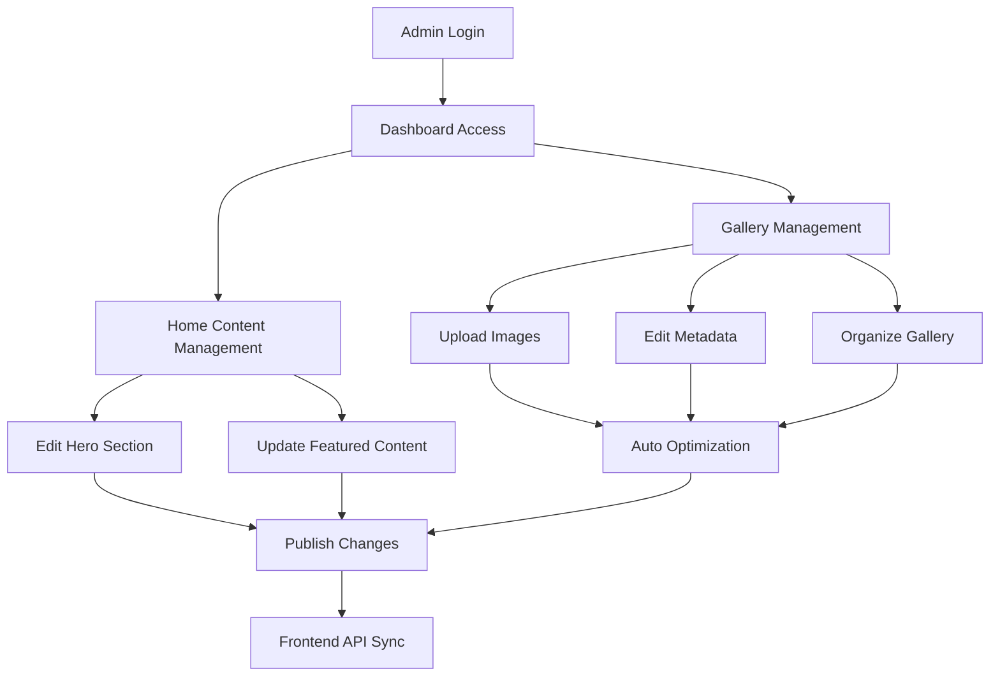

# Backend CMS untuk Home & Gallery - Product Requirements Document

## 1. Product Overview
Backend CMS yang elegan dan profesional untuk mengelola konten Home dan Gallery pada aplikasi luxury restaurant. Sistem ini menyediakan API endpoints yang clean dan secure untuk frontend React, dengan fokus pada manajemen gambar gallery dan konten halaman utama.

Produk ini memungkinkan admin untuk mengelola konten dinamis dengan mudah, mengoptimalkan performa gambar, dan menjaga konsistensi brand luxury restaurant melalui interface yang intuitif.

## 2. Core Features

### 2.1 User Roles
| Role | Registration Method | Core Permissions |
|------|---------------------|------------------|
| Admin | Manual registration dengan approval | Full access ke semua fitur CMS, CRUD operations |
| Super Admin | System-level access | Admin management, system configuration |

### 2.2 Feature Module
Backend CMS terdiri dari modul utama berikut:
1. **Gallery Management**: Upload, edit, delete, dan organize gambar gallery dengan optimasi otomatis.
2. **Home Content Management**: Kelola konten dinamis halaman home seperti hero text, descriptions, dan featured content.
3. **Authentication System**: JWT-based authentication untuk secure access.
4. **Media Management**: Image upload, compression, dan storage optimization.

### 2.3 Page Details
| Module Name | Feature Name | Feature Description |
|-------------|--------------|---------------------|
| Gallery Management | Image Upload | Upload multiple images dengan drag & drop, auto-resize dan compression |
| Gallery Management | Image Organization | Reorder gambar, set featured images, bulk operations |
| Gallery Management | Image Metadata | Edit titles, descriptions, alt text untuk SEO |
| Gallery Management | Image Optimization | Auto-compression, multiple size variants, WebP conversion |
| Home Content | Hero Section | Manage hero title, subtitle, background image/video |
| Home Content | Featured Content | Manage featured dishes, announcements, special offers |
| Home Content | SEO Settings | Meta titles, descriptions, keywords untuk home page |
| Authentication | Admin Login | JWT-based secure login dengan refresh tokens |
| Authentication | Session Management | Auto-logout, session validation, security monitoring |
| Media Management | Storage Management | Cloud storage integration, CDN optimization |
| Media Management | File Validation | Type checking, size limits, security scanning |

## 3. Core Process

**Admin Workflow:**
1. Admin login dengan credentials → JWT token generation
2. Access dashboard → View gallery dan home content overview
3. Gallery management → Upload/edit/delete images → Auto-optimization
4. Home content editing → Update text content → Preview changes
5. Publish changes → Frontend API consumption → Live updates

**API Consumption Flow:**
1. Frontend request → Authentication check → Data retrieval
2. Image requests → CDN delivery → Optimized loading
3. Content updates → Real-time sync → Cache invalidation

## 4. User Interface Design

### 4.1 Design Style
- **Primary Colors**: Deep charcoal (#1a1a1a), Warm gold (#d4af37)
- **Secondary Colors**: Soft white (#fafafa), Muted gray (#6b7280)
- **Button Style**: Rounded corners (8px), subtle shadows, hover animations
- **Typography**: Inter font family, 14-16px base size, clean hierarchy
- **Layout Style**: Card-based design, sidebar navigation, responsive grid
- **Icons**: Lucide React icons, consistent 20px size, minimal style

### 4.2 Page Design Overview
| Module Name | Component Name | UI Elements |
|-------------|----------------|-------------|
| Dashboard | Overview Cards | Statistics cards dengan gradient backgrounds, hover effects |
| Gallery Management | Image Grid | Masonry layout, drag-drop zones, preview modals |
| Gallery Management | Upload Interface | Dropzone dengan progress bars, thumbnail previews |
| Home Content | Content Editor | Rich text editor, live preview, form validation |
| Authentication | Login Form | Centered card layout, animated inputs, security indicators |

### 4.3 Responsiveness
Desktop-first design dengan mobile-adaptive interface. Touch-optimized untuk tablet usage, dengan gesture support untuk image management dan intuitive navigation patterns.