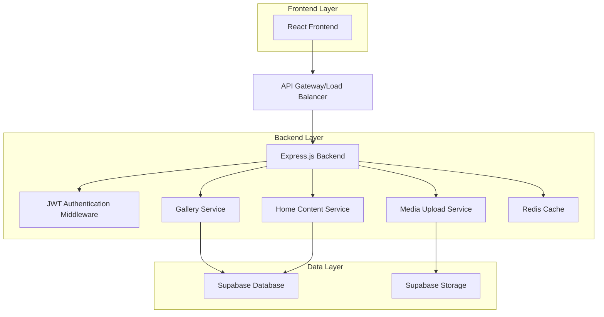
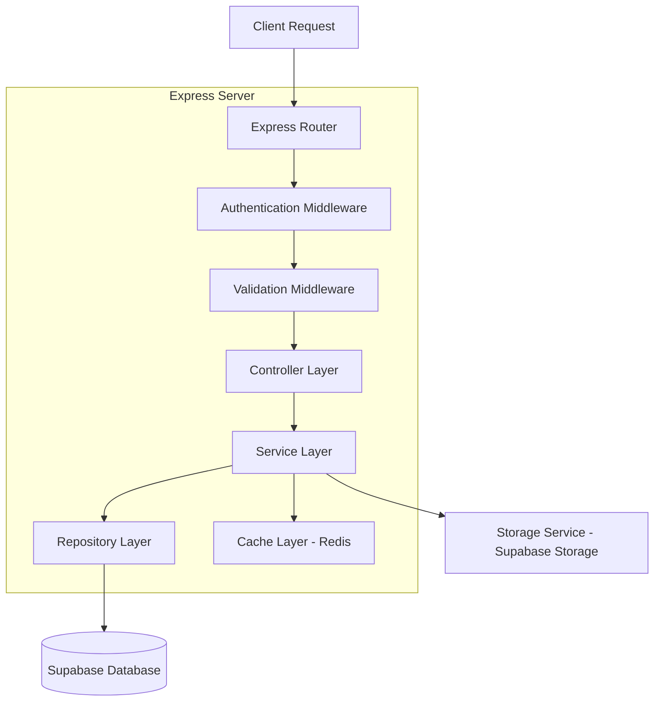
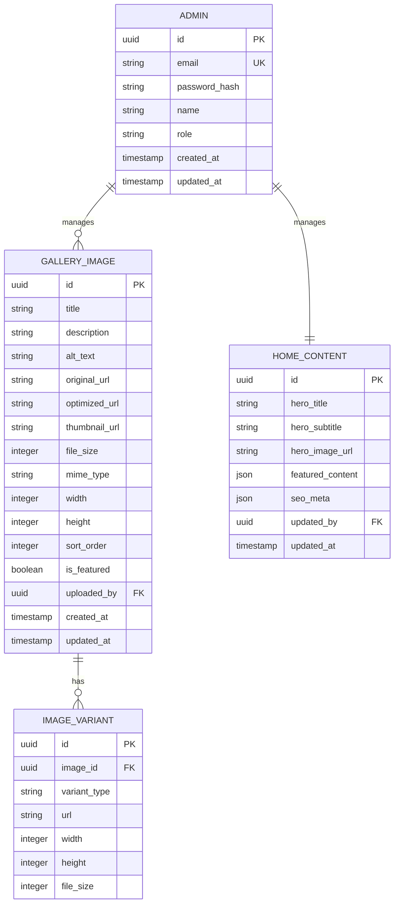

# Backend CMS Home & Gallery - Technical Architecture Document

## 1. Architecture Design



## 2. Technology Description
- Frontend: React@18 + TypeScript + Tailwind CSS
- Backend: Node.js@18 + Express@4 + TypeScript
- Database: Supabase (PostgreSQL)
- Storage: Supabase Storage
- Cache: Redis
- Authentication: JWT + bcrypt
- Image Processing: Sharp
- Validation: Zod

## 3. Route Definitions
| Route | Purpose |
|-------|---------|
| /admin/login | Admin authentication page |
| /admin/dashboard | Main CMS dashboard overview |
| /admin/gallery | Gallery management interface |
| /admin/home | Home content management |
| /admin/media | Media library and upload interface |

## 4. API Definitions

### 4.1 Authentication API

**Admin Login**
```
POST /api/auth/login
```

Request:
| Param Name | Param Type | isRequired | Description |
|------------|------------|------------|-------------|
| email | string | true | Admin email address |
| password | string | true | Admin password (plain text) |

Response:
| Param Name | Param Type | Description |
|------------|------------|-------------|
| success | boolean | Login status |
| token | string | JWT access token |
| refreshToken | string | JWT refresh token |
| user | object | Admin user data |

Example:
```json
{
  "email": "admin@restaurant.com",
  "password": "securePassword123"
}
```

**Token Refresh**
```
POST /api/auth/refresh
```

### 4.2 Gallery API

**Get All Gallery Images**
```
GET /api/gallery/images
```

Response:
| Param Name | Param Type | Description |
|------------|------------|-------------|
| images | array | Array of gallery image objects |
| total | number | Total number of images |

**Upload Gallery Image**
```
POST /api/gallery/images
```

Request (multipart/form-data):
| Param Name | Param Type | isRequired | Description |
|------------|------------|------------|-------------|
| image | file | true | Image file (jpg, png, webp) |
| title | string | false | Image title |
| description | string | false | Image description |
| alt | string | false | Alt text for accessibility |

**Update Gallery Image**
```
PUT /api/gallery/images/:id
```

**Delete Gallery Image**
```
DELETE /api/gallery/images/:id
```

### 4.3 Home Content API

**Get Home Content**
```
GET /api/home/content
```

Response:
| Param Name | Param Type | Description |
|------------|------------|-------------|
| heroTitle | string | Main hero title |
| heroSubtitle | string | Hero subtitle |
| heroImage | string | Hero background image URL |
| featuredContent | array | Featured dishes/content |

**Update Home Content**
```
PUT /api/home/content
```

Request:
| Param Name | Param Type | isRequired | Description |
|------------|------------|------------|-------------|
| heroTitle | string | false | Updated hero title |
| heroSubtitle | string | false | Updated hero subtitle |
| featuredContent | array | false | Updated featured content |

## 5. Server Architecture Diagram



## 6. Data Model

### 6.1 Data Model Definition



### 6.2 Data Definition Language

**Admin Table**
```sql
-- Create admin table
CREATE TABLE admins (
    id UUID PRIMARY KEY DEFAULT gen_random_uuid(),
    email VARCHAR(255) UNIQUE NOT NULL,
    password_hash VARCHAR(255) NOT NULL,
    name VARCHAR(100) NOT NULL,
    role VARCHAR(20) DEFAULT 'admin' CHECK (role IN ('admin', 'super_admin')),
    created_at TIMESTAMP WITH TIME ZONE DEFAULT NOW(),
    updated_at TIMESTAMP WITH TIME ZONE DEFAULT NOW()
);

-- Create indexes
CREATE INDEX idx_admins_email ON admins(email);
CREATE INDEX idx_admins_role ON admins(role);

-- Grant permissions
GRANT SELECT, INSERT, UPDATE ON admins TO authenticated;
GRANT SELECT ON admins TO anon;
```

**Gallery Images Table**
```sql
-- Create gallery_images table
CREATE TABLE gallery_images (
    id UUID PRIMARY KEY DEFAULT gen_random_uuid(),
    title VARCHAR(255),
    description TEXT,
    alt_text VARCHAR(255),
    original_url VARCHAR(500) NOT NULL,
    optimized_url VARCHAR(500),
    thumbnail_url VARCHAR(500),
    file_size INTEGER,
    mime_type VARCHAR(50),
    width INTEGER,
    height INTEGER,
    sort_order INTEGER DEFAULT 0,
    is_featured BOOLEAN DEFAULT FALSE,
    uploaded_by UUID REFERENCES admins(id),
    created_at TIMESTAMP WITH TIME ZONE DEFAULT NOW(),
    updated_at TIMESTAMP WITH TIME ZONE DEFAULT NOW()
);

-- Create indexes
CREATE INDEX idx_gallery_images_sort_order ON gallery_images(sort_order);
CREATE INDEX idx_gallery_images_is_featured ON gallery_images(is_featured);
CREATE INDEX idx_gallery_images_created_at ON gallery_images(created_at DESC);

-- Grant permissions
GRANT ALL PRIVILEGES ON gallery_images TO authenticated;
GRANT SELECT ON gallery_images TO anon;
```

**Image Variants Table**
```sql
-- Create image_variants table
CREATE TABLE image_variants (
    id UUID PRIMARY KEY DEFAULT gen_random_uuid(),
    image_id UUID REFERENCES gallery_images(id) ON DELETE CASCADE,
    variant_type VARCHAR(50) NOT NULL, -- 'thumbnail', 'medium', 'large', 'webp'
    url VARCHAR(500) NOT NULL,
    width INTEGER,
    height INTEGER,
    file_size INTEGER,
    created_at TIMESTAMP WITH TIME ZONE DEFAULT NOW()
);

-- Create indexes
CREATE INDEX idx_image_variants_image_id ON image_variants(image_id);
CREATE INDEX idx_image_variants_type ON image_variants(variant_type);

-- Grant permissions
GRANT ALL PRIVILEGES ON image_variants TO authenticated;
GRANT SELECT ON image_variants TO anon;
```

**Home Content Table**
```sql
-- Create home_content table
CREATE TABLE home_content (
    id UUID PRIMARY KEY DEFAULT gen_random_uuid(),
    hero_title VARCHAR(255),
    hero_subtitle TEXT,
    hero_image_url VARCHAR(500),
    featured_content JSONB DEFAULT '[]'::jsonb,
    seo_meta JSONB DEFAULT '{}'::jsonb,
    updated_by UUID REFERENCES admins(id),
    updated_at TIMESTAMP WITH TIME ZONE DEFAULT NOW()
);

-- Create indexes
CREATE INDEX idx_home_content_updated_at ON home_content(updated_at DESC);

-- Grant permissions
GRANT ALL PRIVILEGES ON home_content TO authenticated;
GRANT SELECT ON home_content TO anon;

-- Insert initial data
INSERT INTO home_content (hero_title, hero_subtitle, featured_content, seo_meta)
VALUES (
    'Luxury Dining Experience',
    'Discover culinary excellence in an elegant atmosphere',
    '[{"title": "Signature Dishes", "description": "Our chef''s special creations"}]'::jsonb,
    '{"title": "Luxury Restaurant", "description": "Fine dining experience"}'::jsonb
);
```