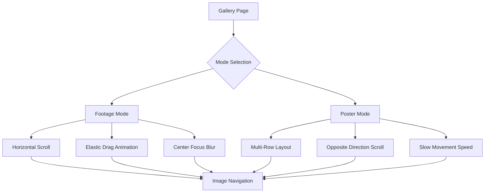

# Luxury Gallery Feature - Product Requirements Document

## 1. Product Overview
Fitur gallery mewah yang terinspirasi dari Siena Film Foundation dengan dua mode interaktif: Footage dan Poster mode. Gallery ini menampilkan koleksi visual dengan animasi elastis yang elegan, efek blur progresif, dan interaksi mouse yang responsif untuk menciptakan pengalaman visual yang immersive dan premium.

- Fitur ini akan menjadi showcase utama untuk menampilkan karya visual dengan kualitas sinematik tinggi
- Target pengguna adalah pengunjung yang mencari pengalaman visual premium dan interaktif
- Nilai pasar: Meningkatkan engagement dan memberikan kesan profesional yang luxury

## 2. Core Features

### 2.1 User Roles
Tidak diperlukan pembedaan role khusus untuk fitur ini - semua pengunjung dapat mengakses dan berinteraksi dengan gallery.

### 2.2 Feature Module
Gallery requirements terdiri dari halaman utama dengan komponen-komponen berikut:
1. **Gallery Page**: mode switcher, image grid layout, navigation controls
2. **Footage Mode**: horizontal scrolling gallery, elastic drag animations, center focus blur
3. **Poster Mode**: multi-row layout, opposite directional scrolling, slow horizontal movement

### 2.3 Page Details

| Page Name | Module Name | Feature description |
|-----------|-------------|---------------------|
| Gallery Page | Mode Switcher | Toggle between Footage and Poster modes with smooth transition animations |
| Gallery Page | Image Grid | Display high-quality images in responsive grid layout with hover effects |
| Gallery Page | Elastic Drag System | Implement rubber-band animation when images are dragged horizontally with bouncing return effect |
| Gallery Page | Progressive Blur | Apply elegant blur effect from center to edges (left/right sides) with smooth gradient |
| Gallery Page | Navigation Controls | Provide intuitive scroll indicators and navigation elements |
| Footage Mode | Horizontal Carousel | Single-row horizontal scrolling with smooth momentum and elastic boundaries |
| Footage Mode | Center Focus | Maintain sharp focus on center image while progressively blurring side images |
| Poster Mode | Multi-Row Layout | Display images in multiple rows (top and bottom sections) |
| Poster Mode | Opposite Scrolling | Top and bottom rows move in opposite directions when horizontally scrolled |
| Poster Mode | Slow Movement | Implement very slow base horizontal movement speed for elegant browsing |

## 3. Core Process

**Main User Flow:**
1. User enters Gallery page and sees default Footage mode
2. User can switch between Footage and Poster modes using mode toggle
3. In Footage mode: User scrolls horizontally to browse images with elastic drag effects
4. In Poster mode: User scrolls horizontally causing top/bottom rows to move in opposite directions
5. User experiences progressive blur effects and smooth animations throughout interaction

## 4. User Interface Design

### 4.1 Design Style
- **Primary Colors**: Deep black (#000000), Pure white (#FFFFFF)
- **Secondary Colors**: Elegant gold accent (#D4AF37), Subtle gray (#1A1A1A)
- **Button Style**: Minimalist rounded buttons with subtle hover animations
- **Font**: Modern sans-serif, primary size 16px, headers 24-32px
- **Layout Style**: Full-screen immersive layout with minimal UI elements
- **Animation Style**: Smooth GSAP-powered transitions with elastic easing
- **Icons**: Minimal line icons for navigation and mode switching

### 4.2 Page Design Overview

| Page Name | Module Name | UI Elements |
|-----------|-------------|-------------|
| Gallery Page | Mode Switcher | Elegant toggle button with "FOOTAGE" and "POSTER" labels, smooth transition animation, positioned top-center |
| Gallery Page | Image Grid | High-quality images with subtle rounded corners, smooth hover scale effects, progressive blur mask overlay |
| Gallery Page | Navigation | Minimal scroll indicators, elegant progress bars, subtle fade-in/out animations |
| Footage Mode | Horizontal Layout | Single-row carousel with center-focused composition, smooth momentum scrolling |
| Poster Mode | Multi-Row Layout | Top and bottom image rows with opposite scrolling directions, synchronized movement |
| Gallery Page | Blur Effects | Radial blur gradient from center to edges, smooth opacity transitions, elegant masking |

### 4.3 Responsiveness
- **Desktop-first design** dengan adaptasi mobile yang optimal
- **Touch interaction optimization** untuk mobile devices dengan gesture support
- **Responsive breakpoints**: Desktop (1200px+), Tablet (768px-1199px), Mobile (320px-767px)
- **Performance optimization** untuk smooth animations across all devices