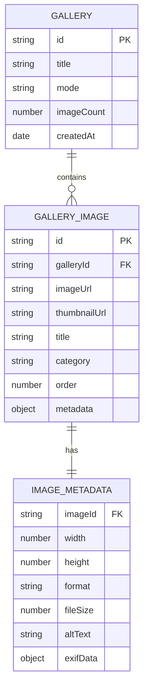

# Luxury Gallery Feature - Technical Architecture Document

## 1. Architecture Design

```mermaid
graph TD
    A[User Browser] --> B[React Gallery Component]
    B --> C[GSAP Animation Engine]
    B --> D[Lenis Smooth Scroll]
    B --> E[Gallery State Management]
    
    C --> F[Elastic Drag Animations]
    C --> G[Progressive Blur Effects]
    C --> H[Mode Transition Animations]
    
    D --> I[Horizontal Scroll Control]
    D --> J[Momentum Scrolling]
    
    E --> K[Mode State (Footage/Poster)]
    E --> L[Image Data Management]
    E --> M[Scroll Position Tracking]

    subgraph "Frontend Layer"
        B
        E
    end

    subgraph "Animation Layer"
        C
        F
        G
        H
    end

    subgraph "Scroll Layer"
        D
        I
        J
    end

    subgraph "State Layer"
        K
        L
        M
    end
```

## 2. Technology Description

* Frontend: React\@18 + TypeScript + Vite + Tailwind CSS\@3

* Animation: GSAP\@3.12 + ScrollTrigger + Draggable

* Smooth Scroll: Lenis\@1.0

* State Management: React Hooks (useState, useEffect, useRef)

* Performance: React.memo + useMemo + useCallback optimizations

## 3. Route Definitions

| Route            | Purpose                                         |
| ---------------- | ----------------------------------------------- |
| /gallery         | Main gallery page with Footage and Poster modes |
| /gallery/footage | Direct access to Footage mode (optional)        |
| /gallery/poster  | Direct access to Poster mode (optional)         |

## 4. Component Architecture

### 4.1 Core Components

**LuxuryGallery Component**

```typescript
interface LuxuryGalleryProps {
  images: GalleryImage[]
  defaultMode?: 'footage' | 'poster'
  onModeChange?: (mode: string) => void
}
```

**FootageMode Component**

```typescript
interface FootageModeProps {
  images: GalleryImage[]
  isActive: boolean
  onImageSelect?: (image: GalleryImage) => void
}
```

**PosterMode Component**

```typescript
interface PosterModeProps {
  images: GalleryImage[]
  isActive: boolean
  scrollSpeed?: number
}
```

### 4.2 Animation Hooks

**useElasticDrag Hook**

```typescript
interface ElasticDragOptions {
  elasticity: number
  bounceStrength: number
  returnDuration: number
}

const useElasticDrag = (
  elementRef: RefObject<HTMLElement>,
  options: ElasticDragOptions
) => {
  // Implementation for elastic drag animations
}
```

**useProgressiveBlur Hook**

```typescript
interface ProgressiveBlurOptions {
  blurRadius: number
  fadeDistance: number
  centerFocus: boolean
}

const useProgressiveBlur = (
  containerRef: RefObject<HTMLElement>,
  options: ProgressiveBlurOptions
) => {
  // Implementation for progressive blur effects
}
```

## 5. Animation Specifications

### 5.1 Elastic Drag Animation

```typescript
// GSAP Timeline for elastic drag effect
const createElasticDragAnimation = (element: HTMLElement) => {
  const tl = gsap.timeline()
  
  // Stretch phase
  tl.to(element, {
    scaleX: 1.2,
    scaleY: 0.9,
    duration: 0.3,
    ease: "power2.out"
  })
  
  // Bounce back phase
  tl.to(element, {
    scaleX: 1,
    scaleY: 1,
    duration: 0.5,
    ease: "elastic.out(1, 0.5)"
  })
  
  return tl
}
```

### 5.2 Progressive Blur Effect

```typescript
// CSS-in-JS for progressive blur
const progressiveBlurStyles = {
  maskImage: `radial-gradient(
    ellipse 60% 50% at center,
    rgba(0,0,0,1) 0%,
    rgba(0,0,0,0.8) 40%,
    rgba(0,0,0,0.3) 70%,
    rgba(0,0,0,0) 100%
  )`,
  backdropFilter: 'blur(0px)',
  transition: 'backdrop-filter 0.3s ease-out'
}
```

### 5.3 Opposite Direction Scrolling (Poster Mode)

```typescript
// GSAP ScrollTrigger for opposite scrolling
const setupOppositeScrolling = (topRow: HTMLElement, bottomRow: HTMLElement) => {
  ScrollTrigger.create({
    trigger: ".poster-container",
    start: "left right",
    end: "right left",
    scrub: 1,
    onUpdate: (self) => {
      const progress = self.progress
      gsap.set(topRow, { x: progress * -200 })
      gsap.set(bottomRow, { x: progress * 200 })
    }
  })
}
```

## 6. Data Model

### 6.1 Data Model Definition



### 6.2 TypeScript Interfaces

```typescript
interface GalleryImage {
  id: string
  imageUrl: string
  thumbnailUrl: string
  title: string
  category: 'footage' | 'poster'
  order: number
  metadata: ImageMetadata
}

interface ImageMetadata {
  width: number
  height: number
  format: string
  fileSize: number
  altText: string
  exifData?: Record<string, any>
}

interface GalleryState {
  mode: 'footage' | 'poster'
  images: GalleryImage[]
  currentIndex: number
  isLoading: boolean
  scrollPosition: number
}

interface AnimationConfig {
  elastic: {
    strength: number
    duration: number
    ease: string
  }
  blur: {
    radius: number
    fadeDistance: number
  }
  scroll: {
    speed: number
    momentum: number
  }
}
```

## 7. Performance Optimizations

### 7.1 Image Loading Strategy

* **Lazy loading** dengan Intersection Observer API

* **Progressive image loading** dengan placeholder blur

* **WebP format** dengan fallback ke JPEG

* **Responsive images** dengan srcset untuk different screen sizes

### 7.2 Animation Performance

* **GPU acceleration** dengan transform3d dan will-change properties

* **RequestAnimationFrame** untuk smooth 60fps animations

* **Debounced scroll events** untuk optimal performance

* **Memory management** dengan proper cleanup di useEffect

### 7.3 Bundle Optimization

* **Code splitting** untuk gallery components

* **Dynamic imports** untuk mode-specific components

* **Tree shaking** untuk unused GSAP plugins

* **Image optimization** dengan Vite asset processing

