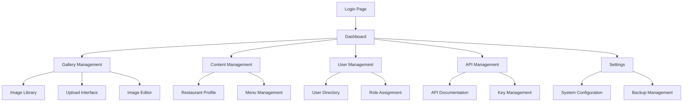

# Luxury Restaurant CMS - Product Requirements Document

## 1. Product Overview

A sophisticated Content Management System designed specifically for luxury restaurant operations, providing seamless gallery management, content administration, and API services for premium dining establishments.

The CMS empowers restaurant administrators to manage visual content, restaurant information, and digital assets through an elegant, professional interface while serving optimized content to frontend applications.

This system targets high-end restaurants requiring premium digital presence with enterprise-level content management capabilities.

## 2. Core Features

### 2.1 User Roles

| Role | Registration Method | Core Permissions |
|------|---------------------|------------------|
| Super Admin | System initialization | Full system access, user management, system configuration |
| Restaurant Admin | Invitation by Super Admin | Gallery management, content editing, analytics viewing |
| Content Manager | Invitation by Admin | Image upload, content creation, basic editing |
| Viewer | API key access | Read-only API access for frontend applications |

### 2.2 Feature Module

Our luxury restaurant CMS consists of the following essential pages:

1. **Dashboard**: Analytics overview, quick actions, system status monitoring
2. **Gallery Management**: Image upload, organization, metadata editing, batch operations
3. **Content Management**: Restaurant information, menu details, location data
4. **User Management**: Role assignment, access control, invitation system
5. **API Management**: Endpoint documentation, key management, usage analytics
6. **Settings**: System configuration, image optimization settings, backup management

### 2.3 Page Details

| Page Name | Module Name | Feature description |
|-----------|-------------|---------------------|
| Dashboard | Analytics Overview | Display gallery statistics, recent uploads, API usage metrics, system health indicators |
| Dashboard | Quick Actions | Provide shortcuts for common tasks like bulk upload, content publishing, user invitations |
| Gallery Management | Image Library | Browse, search, filter images with advanced metadata, support for categories and tags |
| Gallery Management | Upload Interface | Drag-and-drop upload, batch processing, automatic optimization, progress tracking |
| Gallery Management | Image Editor | Basic editing tools, crop, resize, filter application, metadata editing |
| Gallery Management | Organization Tools | Album creation, category management, bulk operations, sorting and filtering |
| Content Management | Restaurant Profile | Edit restaurant information, contact details, operating hours, location data |
| Content Management | Menu Management | Create and manage menu items, categories, pricing, availability status |
| Content Management | SEO Management | Meta tags, descriptions, keywords optimization for search engines |
| User Management | User Directory | View all users, roles, last activity, account status management |
| User Management | Role Assignment | Assign and modify user permissions, create custom roles, access control |
| User Management | Invitation System | Send invitations, manage pending invites, onboarding workflow |
| API Management | Endpoint Documentation | Interactive API documentation, request/response examples, authentication guides |
| API Management | Key Management | Generate, revoke, monitor API keys, usage limits, security settings |
| API Management | Usage Analytics | API call statistics, performance metrics, error tracking, rate limiting |
| Settings | System Configuration | General settings, email configuration, notification preferences |
| Settings | Image Settings | Upload limits, compression settings, format preferences, storage configuration |
| Settings | Backup Management | Automated backups, restore options, data export, system maintenance |

## 3. Core Process

**Super Admin Flow:**
The Super Admin initializes the system, configures basic settings, and creates the first Restaurant Admin account. They manage system-wide configurations, monitor overall performance, and handle user management at the highest level.

**Restaurant Admin Flow:**
Restaurant Admins log in to access the dashboard, review analytics, and manage gallery content. They upload new images, organize existing content, update restaurant information, and invite Content Managers. They also monitor API usage and manage content publication workflows.

**Content Manager Flow:**
Content Managers focus on day-to-day content operations. They upload images, add metadata, organize gallery albums, and update menu information. They work within permissions set by Restaurant Admins.

**API Consumer Flow:**
Frontend applications authenticate using API keys, request gallery data, retrieve restaurant information, and consume optimized images. The API provides filtered, cached responses for optimal performance.

## 4. User Interface Design

### 4.1 Design Style

- **Primary Colors**: Deep charcoal (#1a1a1a), Luxury gold (#d4af37), Pure white (#ffffff)
- **Secondary Colors**: Warm gray (#f5f5f5), Accent amber (#fbbf24), Success green (#10b981)
- **Button Style**: Rounded corners (8px), subtle shadows, hover animations with color transitions
- **Typography**: Inter for headings (24px-32px), Source Sans Pro for body text (14px-16px), monospace for code
- **Layout Style**: Clean card-based design, generous white space, left sidebar navigation, responsive grid system
- **Icons**: Lucide React icons with consistent 20px size, subtle hover effects, contextual color coding

### 4.2 Page Design Overview