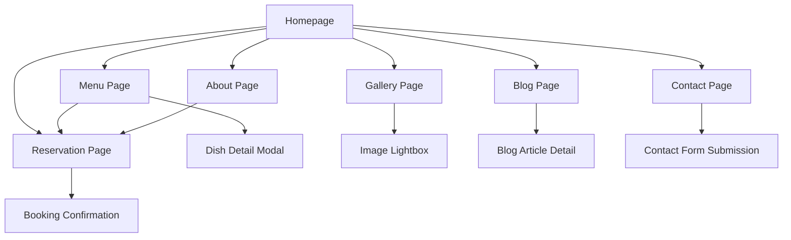

# Premium Restaurant/Culinary Platform - Product Requirements Document

## 1. Product Overview

Sebuah platform website premium untuk restoran high-end yang menampilkan pengalaman kuliner eksklusif dengan desain modern dan elegan. Platform ini menggabungkan storytelling visual yang kuat dengan sistem manajemen konten yang fleksibel untuk memberikan pengalaman digital yang memukau bagi calon pelanggan.

Website ini ditujukan untuk restoran premium yang ingin meningkatkan brand presence dan menyediakan pengalaman booking yang seamless. Platform ini akan membantu restoran dalam mengelola konten, reservasi, dan membangun hubungan yang lebih kuat dengan pelanggan melalui storytelling kuliner yang menarik.

Target market: Restoran fine dining, chef celebrity, dan establishment kuliner premium yang mengutamakan kualitas dan pengalaman pelanggan.

## 2. Core Features

### 2.1 User Roles

| Role | Registration Method | Core Permissions |
|------|---------------------|------------------|
| Guest User | Tidak perlu registrasi | Dapat melihat menu, gallery, membaca blog, dan melakukan reservasi |
| Admin | Login dengan credentials | Dapat mengelola semua konten, menu, reservasi, blog posts, dan gallery melalui CMS |
| Chef/Staff | Invitation-based login | Dapat mengelola menu items, blog posts kuliner, dan melihat reservasi |

### 2.2 Feature Module

Platform restoran premium kami terdiri dari halaman-halaman utama berikut:

1. **Homepage**: Hero section dengan video/gambar signature dish, featured menu highlights, chef's philosophy preview, dan call-to-action untuk reservasi.
2. **Menu Page**: Interactive menu showcase dengan kategori (appetizers, mains, desserts, beverages), filter berdasarkan dietary preferences, dan detail lengkap setiap dish.
3. **About Page**: Chef's story dan background, restaurant philosophy, awards dan recognition, team introduction.
4. **Gallery Page**: Food photography showcase, restaurant ambiance photos, behind-the-scenes kitchen moments, event photos.
5. **Blog Page**: Culinary articles, recipe sharing, ingredient spotlights, cooking techniques, restaurant news.
6. **Reservation Page**: Interactive booking system dengan date picker, time slots, party size selection, special requests form.
7. **Contact Page**: Location dengan interactive map, contact information, operating hours, social media links.

### 2.3 Page Details

| Page Name | Module Name | Feature description |
|-----------|-------------|---------------------|
| Homepage | Hero Section | Display signature dish video/image with overlay text, smooth scroll animations, call-to-action buttons |
| Homepage | Featured Menu | Showcase 3-4 signature dishes with high-quality images, brief descriptions, pricing |
| Homepage | Chef's Philosophy | Brief introduction to chef's culinary approach with portrait photo and quote |
| Homepage | Testimonials | Customer reviews carousel with star ratings and photos |
| Menu Page | Menu Categories | Interactive tabs for different course categories with smooth transitions |
| Menu Page | Dish Details | Modal popup with detailed description, ingredients, allergen info, pricing, dietary tags |
| Menu Page | Filter System | Filter by dietary preferences (vegetarian, vegan, gluten-free), price range, spice level |
| About Page | Chef Biography | Detailed chef background, culinary journey, awards, philosophy with professional photos |
| About Page | Restaurant Story | History of the restaurant, mission, vision, unique selling points |
| About Page | Team Showcase | Key staff members with photos and brief descriptions |
| Gallery Page | Food Photography | High-resolution images organized by categories with lightbox view |
| Gallery Page | Restaurant Ambiance | Interior and exterior photos showcasing dining atmosphere |
| Gallery Page | Kitchen Behind-Scenes | Photos of food preparation, chef in action, kitchen environment |
| Blog Page | Article Listing | Grid layout of blog posts with featured images, excerpts, publish dates, categories |
| Blog Page | Article Detail | Full article view with rich text, images, social sharing buttons, related posts |
| Blog Page | Recipe Posts | Step-by-step recipes with ingredient lists, cooking instructions, photos |
| Reservation Page | Booking Form | Date picker, time slots, party size, contact details, special requests |
| Reservation Page | Availability Check | Real-time availability checking with alternative suggestions |
| Reservation Page | Confirmation System | Booking confirmation with email notification and calendar integration |
| Contact Page | Location Map | Interactive Google Maps integration with restaurant location |
| Contact Page | Contact Information | Address, phone, email, operating hours, social media links |
| Contact Page | Contact Form | General inquiry form with subject categories and message field |

## 3. Core Process

**Guest User Flow:**
Pengunjung mengakses homepage dan tertarik dengan hero section yang menampilkan signature dish. Mereka kemudian menjelajahi menu interaktif untuk melihat berbagai pilihan makanan, membaca tentang chef dan filosofi restoran di halaman About, melihat gallery untuk merasakan ambiance, dan akhirnya melakukan reservasi melalui sistem booking yang terintegrasi.

**Admin Flow:**
Admin login ke CMS dashboard untuk mengelola konten website. Mereka dapat mengupdate menu items dengan foto dan deskripsi baru, menambahkan blog posts tentang kuliner, mengelola gallery photos, melihat dan mengkonfirmasi reservasi, serta mengupdate informasi restoran.

## 4. User Interface Design

### 4.1 Design Style

- **Primary Colors**: Deep charcoal (#2C2C2C) untuk elegance, warm gold (#D4AF37) untuk luxury accents
- **Secondary Colors**: Cream white (#F8F6F0) untuk backgrounds, soft gray (#F5F5F5) untuk subtle sections
- **Button Style**: Rounded corners dengan subtle shadows, hover animations dengan color transitions
- **Typography**: Playfair Display untuk headings (elegant serif), Inter untuk body text (clean sans-serif)
- **Font Sizes**: H1: 48px, H2: 36px, H3: 24px, Body: 16px, Caption: 14px
- **Layout Style**: Card-based design dengan generous white space, grid layouts untuk gallery dan menu
- **Icons**: Minimalist line icons dengan consistent stroke width, food-related icons untuk menu categories
- **Animations**: Smooth fade-in effects, parallax scrolling, hover transformations, loading animations

### 4.2 Page Design Overview

| Page Name | Module Name | UI Elements |
|-----------|-------------|-------------|
| Homepage | Hero Section | Full-screen video background, overlay gradient, centered typography, floating CTA buttons with glow effects |
| Homepage | Featured Menu | Card grid layout, high-quality food photography, elegant typography, subtle shadows, hover zoom effects |
| Menu Page | Menu Categories | Horizontal tab navigation, smooth transitions, active state indicators, responsive grid for dishes |
| Menu Page | Dish Modal | Centered modal with backdrop blur, large food image, elegant typography, ingredient tags, close animation |
| About Page | Chef Section | Split layout with large portrait photo, elegant quote typography, background texture, parallax elements |
| Gallery Page | Photo Grid | Masonry layout, hover overlays, smooth lightbox transitions, category filter buttons |
| Blog Page | Article Cards | Clean card design, featured images, typography hierarchy, read time indicators, category badges |
| Reservation Page | Booking Form | Step-by-step form design, date picker styling, time slot buttons, progress indicators |
| Contact Page | Map Integration | Full-width map section, overlay contact card, location pin animation, responsive design |

### 4.3 Responsiveness

Platform ini menggunakan mobile-first approach dengan breakpoints: Mobile (320px-768px), Tablet (768px-1024px), Desktop (1024px+). Touch interaction optimization untuk mobile devices termasuk larger tap targets, swipe gestures untuk gallery, dan optimized form inputs. Navigation menggunakan hamburger menu pada mobile dengan smooth slide-in animation.