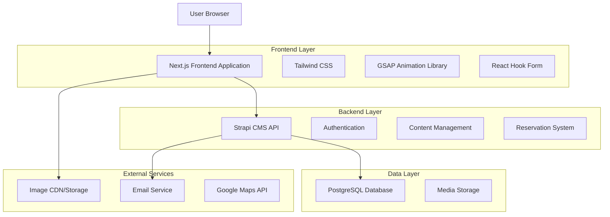
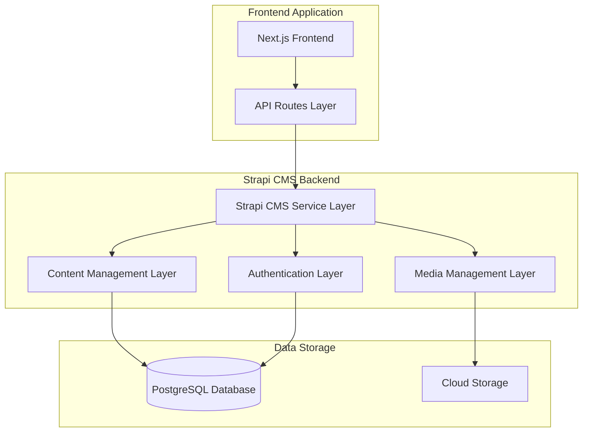
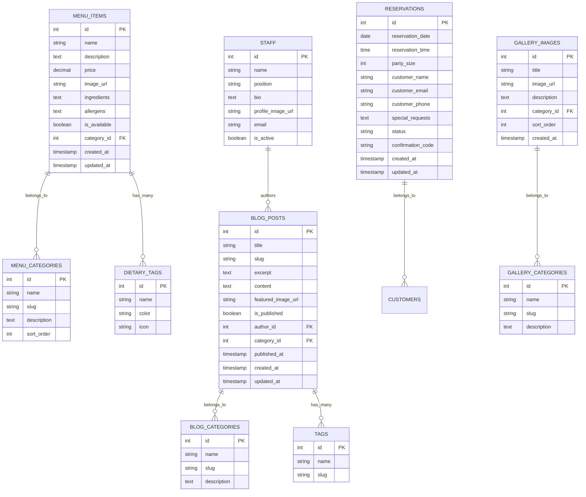

# Premium Restaurant Platform - Technical Architecture Document

## 1. Architecture Design



## 2. Technology Description

* Frontend: Next.js@14 + TypeScript + Tailwind CSS@3 + GSAP@3.12 + Lenis@1.0

* Backend: Strapi@4 (Headless CMS)

* Database: PostgreSQL@15

* Image Storage: Cloudinary or AWS S3

* Email Service: SendGrid or Nodemailer

* Maps: Google Maps API

* Deployment: Vercel (Frontend) + Railway/Heroku (Backend)

### Animation Technology Stack

* **GSAP (GreenSock Animation Platform)**: Primary animation library for all UI animations
  - ScrollTrigger plugin for scroll-based animations
  - Timeline-based animations for complex sequences
  - Custom cursor follower animations
  - Parallax effects and smooth transitions

* **Lenis**: Smooth scrolling library for enhanced user experience
  - Hardware-accelerated smooth scrolling
  - Integration with GSAP ScrollTrigger
  - Custom scroll behavior and momentum

* **Custom Animation Hooks**: 
  - `useScrollAnimations`: GSAP-based scroll animations
  - `useLenis`: Smooth scrolling integration
  - Custom animation utilities for consistent motion design

## 3. Route Definitions

| Route         | Purpose                                                          |
| ------------- | ---------------------------------------------------------------- |
| /             | Homepage with hero section, featured menu, and chef introduction |
| /menu         | Interactive menu showcase with categories and filtering          |
| /about        | Chef biography, restaurant story, and team information           |
| /gallery      | Food photography and restaurant ambiance showcase                |
| /blog         | Culinary articles and recipe posts listing                       |
| /blog/\[slug] | Individual blog post detail page                                 |
| /reservation  | Booking system with date/time selection                          |
| /contact      | Contact information, location map, and inquiry form              |
| /admin        | Strapi CMS admin dashboard (separate domain/subdomain)           |

## 4. API Definitions

### 4.1 Core API

**Menu Items Management**

```
GET /api/menu-items
```

Response:

| Param Name    | Param Type | Description                                          |
| ------------- | ---------- | ---------------------------------------------------- |
| id            | number     | Unique identifier for menu item                      |
| name          | string     | Name of the dish                                     |
| description   | string     | Detailed description of the dish                     |
| price         | number     | Price in local currency                              |
| category      | string     | Category (appetizer, main, dessert, beverage)        |
| image         | object     | Image URL and metadata                               |
| dietary\_tags | array      | Dietary information (vegetarian, vegan, gluten-free) |
| ingredients   | array      | List of main ingredients                             |
| allergens     | array      | Allergen information                                 |

**Reservation System**

```
POST /api/reservations
```

Request:

| Param Name        | Param Type | isRequired | Description                         |
| ----------------- | ---------- | ---------- | ----------------------------------- |
| date              | string     | true       | Reservation date (YYYY-MM-DD)       |
| time              | string     | true       | Reservation time (HH:MM)            |
| party\_size       | number     | true       | Number of guests                    |
| customer\_name    | string     | true       | Customer full name                  |
| customer\_email   | string     | true       | Customer email address              |
| customer\_phone   | string     | true       | Customer phone number               |
| special\_requests | string     | false      | Special dietary or seating requests |

Response:

| Param Name         | Param Type | Description                                        |
| ------------------ | ---------- | -------------------------------------------------- |
| id                 | number     | Reservation ID                                     |
| status             | string     | Reservation status (confirmed, pending, cancelled) |
| confirmation\_code | string     | Unique confirmation code                           |

**Blog Posts**

```
GET /api/blog-posts
```

Response:

| Param Name      | Param Type | Description                             |
| --------------- | ---------- | --------------------------------------- |
| id              | number     | Post unique identifier                  |
| title           | string     | Blog post title                         |
| slug            | string     | URL-friendly slug                       |
| excerpt         | string     | Short description/preview               |
| content         | string     | Full blog post content (markdown)       |
| featured\_image | object     | Featured image URL and metadata         |
| author          | object     | Author information                      |
| published\_at   | string     | Publication date                        |
| category        | string     | Post category (recipe, news, technique) |
| tags            | array      | Associated tags                         |

## 5. Server Architecture Diagram



## 6. Data Model

### 6.1 Data Model Definition



### 6.2 Data Definition Language

**Menu Items Table**

```sql
-- Create menu categories table
CREATE TABLE menu_categories (
    id SERIAL PRIMARY KEY,
    name VARCHAR(100) NOT NULL,
    slug VARCHAR(100) UNIQUE NOT NULL,
    description TEXT,
    sort_order INTEGER DEFAULT 0,
    created_at TIMESTAMP WITH TIME ZONE DEFAULT NOW(),
    updated_at TIMESTAMP WITH TIME ZONE DEFAULT NOW()
);

-- Create menu items table
CREATE TABLE menu_items (
    id SERIAL PRIMARY KEY,
    name VARCHAR(200) NOT NULL,
    description TEXT,
    price DECIMAL(10,2) NOT NULL,
    image_url VARCHAR(500),
    ingredients TEXT,
    allergens TEXT,
    is_available BOOLEAN DEFAULT true,
    category_id INTEGER REFERENCES menu_categories(id),
    created_at TIMESTAMP WITH TIME ZONE DEFAULT NOW(),
    updated_at TIMESTAMP WITH TIME ZONE DEFAULT NOW()
);

-- Create dietary tags table
CREATE TABLE dietary_tags (
    id SERIAL PRIMARY KEY,
    name VARCHAR(50) NOT NULL,
    color VARCHAR(7) DEFAULT '#000000',
    icon VARCHAR(50)
);

-- Create menu item dietary tags junction table
CREATE TABLE menu_item_dietary_tags (
    menu_item_id INTEGER REFERENCES menu_items(id) ON DELETE CASCADE,
    dietary_tag_id INTEGER REFERENCES dietary_tags(id) ON DELETE CASCADE,
    PRIMARY KEY (menu_item_id, dietary_tag_id)
);

-- Create indexes
CREATE INDEX idx_menu_items_category ON menu_items(category_id);
CREATE INDEX idx_menu_items_available ON menu_items(is_available);
CREATE INDEX idx_menu_categories_sort ON menu_categories(sort_order);

-- Insert initial data
INSERT INTO menu_categories (name, slug, description, sort_order) VALUES
('Appetizers', 'appetizers', 'Start your culinary journey', 1),
('Main Courses', 'main-courses', 'Our signature dishes', 2),
('Desserts', 'desserts', 'Sweet endings', 3),
('Beverages', 'beverages', 'Curated drink selection', 4);

INSERT INTO dietary_tags (name, color, icon) VALUES
('Vegetarian', '#4CAF50', 'leaf'),
('Vegan', '#8BC34A', 'sprout'),
('Gluten-Free', '#FF9800', 'wheat-off'),
('Spicy', '#F44336', 'flame'),
('Chef Special', '#9C27B0', 'star');
```

**Blog System Tables**

```sql
-- Create blog categories table
CREATE TABLE blog_categories (
    id SERIAL PRIMARY KEY,
    name VARCHAR(100) NOT NULL,
    slug VARCHAR(100) UNIQUE NOT NULL,
    description TEXT,
    created_at TIMESTAMP WITH TIME ZONE DEFAULT NOW()
);

-- Create staff table
CREATE TABLE staff (
    id SERIAL PRIMARY KEY,
    name VARCHAR(100) NOT NULL,
    position VARCHAR(100),
    bio TEXT,
    profile_image_url VARCHAR(500),
    email VARCHAR(255) UNIQUE,
    is_active BOOLEAN DEFAULT true,
    created_at TIMESTAMP WITH TIME ZONE DEFAULT NOW()
);

-- Create blog posts table
CREATE TABLE blog_posts (
    id SERIAL PRIMARY KEY,
    title VARCHAR(300) NOT NULL,
    slug VARCHAR(300) UNIQUE NOT NULL,
    excerpt TEXT,
    content TEXT,
    featured_image_url VARCHAR(500),
    is_published BOOLEAN DEFAULT false,
    author_id INTEGER REFERENCES staff(id),
    category_id INTEGER REFERENCES blog_categories(id),
    published_at TIMESTAMP WITH TIME ZONE,
    created_at TIMESTAMP WITH TIME ZONE DEFAULT NOW(),
    updated_at TIMESTAMP WITH TIME ZONE DEFAULT NOW()
);

-- Create tags table
CREATE TABLE tags (
    id SERIAL PRIMARY KEY,
    name VARCHAR(50) NOT NULL,
    slug VARCHAR(50) UNIQUE NOT NULL
);

-- Create blog post tags junction table
CREATE TABLE blog_post_tags (
    blog_post_id INTEGER REFERENCES blog_posts(id) ON DELETE CASCADE,
    tag_id INTEGER REFERENCES tags(id) ON DELETE CASCADE,
    PRIMARY KEY (blog_post_id, tag_id)
);

-- Create indexes
CREATE INDEX idx_blog_posts_published ON blog_posts(is_published, published_at DESC);
CREATE INDEX idx_blog_posts_author ON blog_posts(author_id);
CREATE INDEX idx_blog_posts_category ON blog_posts(category_id);
CREATE INDEX idx_blog_posts_slug ON blog_posts(slug);

-- Insert initial data
INSERT INTO blog_categories (name, slug, description) VALUES
('Recipes', 'recipes', 'Step-by-step cooking guides'),
('Culinary News', 'culinary-news', 'Latest updates from our kitchen'),
('Techniques', 'techniques', 'Professional cooking techniques'),
('Ingredients', 'ingredients', 'Spotlight on premium ingredients');
```

**Reservation System Tables**

```sql
-- Create reservations table
CREATE TABLE reservations (
    id SERIAL PRIMARY KEY,
    reservation_date DATE NOT NULL,
    reservation_time TIME NOT NULL,
    party_size INTEGER NOT NULL CHECK (party_size > 0 AND party_size <= 20),
    customer_name VARCHAR(100) NOT NULL,
    customer_email VARCHAR(255) NOT NULL,
    customer_phone VARCHAR(20) NOT NULL,
    special_requests TEXT,
    status VARCHAR(20) DEFAULT 'pending' CHECK (status IN ('pending', 'confirmed', 'cancelled', 'completed')),
    confirmation_code VARCHAR(10) UNIQUE NOT NULL,
    created_at TIMESTAMP WITH TIME ZONE DEFAULT NOW(),
    updated_at TIMESTAMP WITH TIME ZONE DEFAULT NOW()
);

-- Create gallery system tables
CREATE TABLE gallery_categories (
    id SERIAL PRIMARY KEY,
    name VARCHAR(100) NOT NULL,
    slug VARCHAR(100) UNIQUE NOT NULL,
    description TEXT,
    sort_order INTEGER DEFAULT 0
);

CREATE TABLE gallery_images (
    id SERIAL PRIMARY KEY,
    title VARCHAR(200),
    image_url VARCHAR(500) NOT NULL,
    description TEXT,
    category_id INTEGER REFERENCES gallery_categories(id),
    sort_order INTEGER DEFAULT 0,
    created_at TIMESTAMP WITH TIME ZONE DEFAULT NOW()
);

-- Create indexes
CREATE INDEX idx_reservations_date_time ON reservations(reservation_date, reservation_time);
CREATE INDEX idx_reservations_status ON reservations(status);
CREATE INDEX idx_reservations_email ON reservations(customer_email);
CREATE INDEX idx_gallery_images_category ON gallery_images(category_id);

-- Insert initial gallery categories
INSERT INTO gallery_categories (name, slug, description, sort_order) VALUES
('Food Photography', 'food-photography', 'Our signature dishes', 1),
('Restaurant Ambiance', 'restaurant-ambiance', 'Dining atmosphere', 2),
('Kitchen Behind Scenes', 'kitchen-behind-scenes', 'Our culinary team at work', 3),
('Events', 'events', 'Special occasions and celebrations', 4);
```

